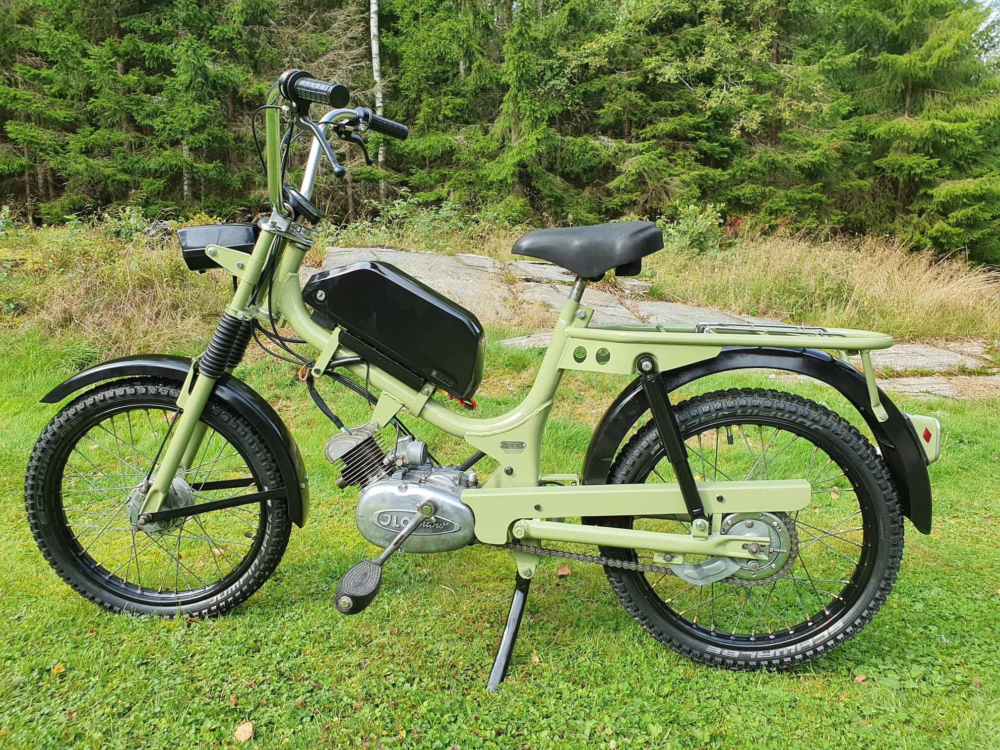
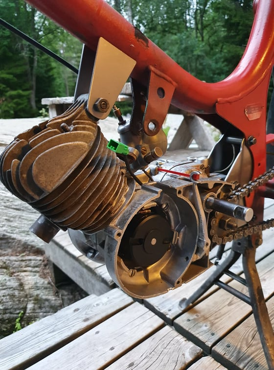
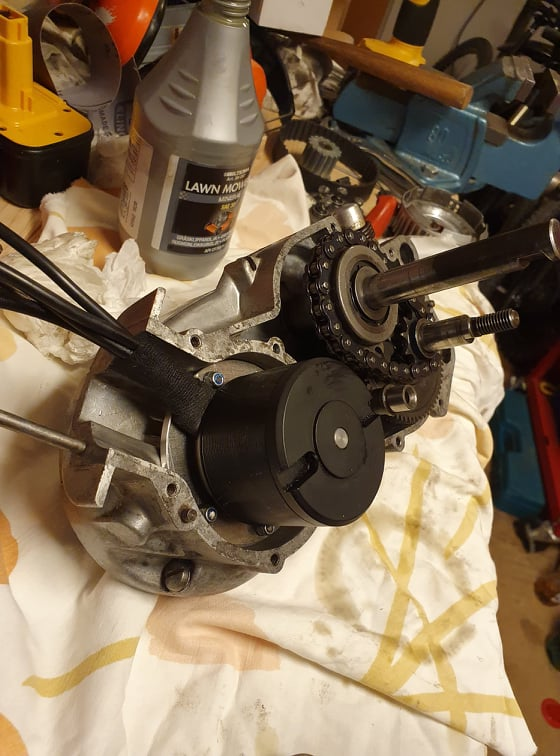
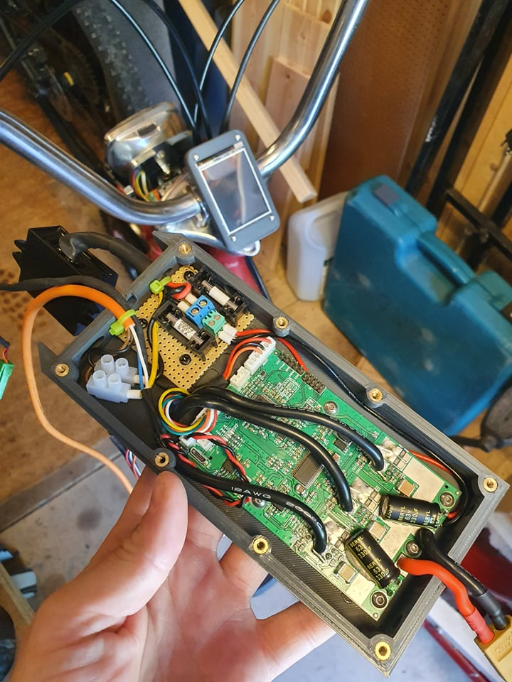
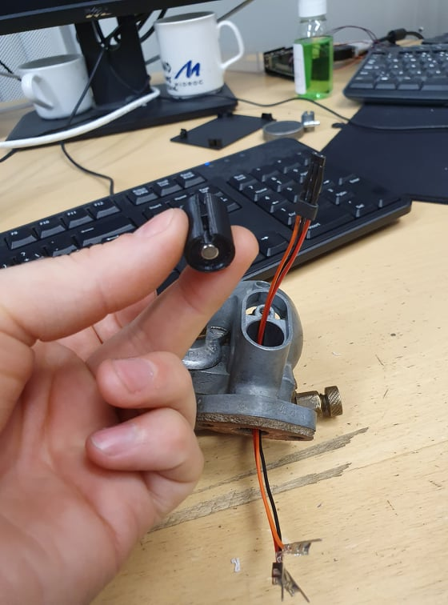
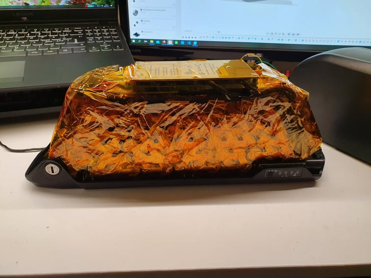
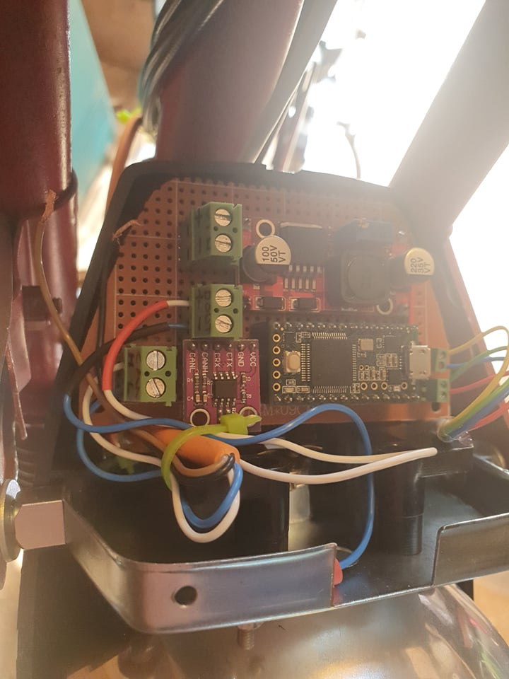
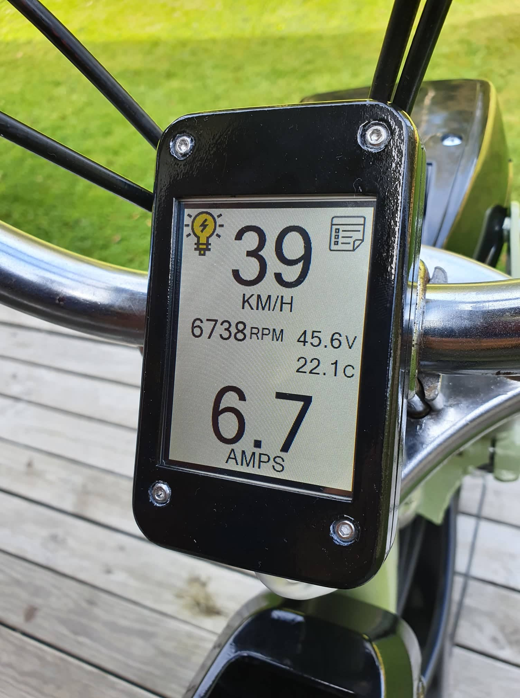

The story of how a vintage moped got a new electrified life! 
  

In the beginning of 2020 i got the idea to convert an old 70's two-stroke moped to electric power. 
Now, two years later, and not too many iterations of my ideas it's finished! More or less finished anyway! :) 

 
 

Basically i fitted an electric skateboard motor inside the old two-stroke motor, leaving the 2-speed gearbox.
I chopped off the old crankshaft axle and drilled a hole in the shaft so that the electric motor shaft
would fit directly into it. I then removed enough material from one of the motor blocks so the eletric
motor would fit inside the motor case, a simple adapter plate in aluminium holds the BLDC motor in place. 

 
 
 
 
 
 

The electric motor is driven by a BLDC motor controller which offers a lot of settings and also CAN-communication.
I'm getting the throttle signal from the regular wire throttle handle, however i've modified the carburetor "slightly".
The throttle slide is now 3d printed and instead of a needle letting fuel inside the cylinder, there is now a magnet in it's place. 
This magnet affects the linear hall effect sensor which is mounted in the bottom of the carburetor, which in turn gives a analog 
signal based on the amount of flux it's picking up, this analog signal is read by the motor controller as the input throttle signal.

 

 
 
 

The battery is made up out of geniune 18650 Tesla cells salvaged from a model S, which are 4.2volts max and 3Ah each. 
There are 12 cells in series and 7 in parallel, a total of 84cells. Fully charged it's 50.4Volts and 21Ah, which gives 1kWh of power!
Making the battery was probably the most tedius job of the build, a part from the sanding and painting. All 84 cells are spot welded
together with pure nickel strip, and controlled and monitored by a BMS system, which lets you connect over Bluetooth to monitor 
the health and status of the battery.
 

 
 
 

To be able to see the stats of the motor controller, like rpm/battery voltage/ battery current etc. I made a small PCB which main jobs
are: Talk to motor controller via CAN, send data to display unit and turn on/off the head and rear light.
The microcontroller i chosed to use was the teensy 3.2 due to it's speed and built in can controller (it still needs a CAN-transceiver).
Other parts were sourced mainly because i had them laying around, and they will be replaced by a manufactured PCB when i get the time,
and when the parts are available. The display i used is a 2.4" touch display from Nextion. I chosed this mainly because i already had it,
but also due to it's ease of use in these simple cases. 

 

 

 
 

So what about the fun info? How fast does it go, and how far can you drive? Well, the speed is not that exciting, with the maximum gearing 
i can reach somwhere around 40-45km/h, but this runs the motor quite hot so without any way of measuring the motor temperature right now
i am going with more moderate gearing with which i reach around 30-35km/h and then it also has a bit of a kick to it acceleration wise.
As far as the range, i cannot really say for sure since i havent dared to try due to not measuring temperature, however in the initial testing phase, 
i got at least 10km of range with a 5Ah battery, so i should get a range of at least 40km. So in other words, not that bad right?
 
 

Youtube clip:

  

 
 
 
Future plans and improvements: 
Custom PCB with a esp32 as microcontroller, this is mainly to try to get BMS information and display it. 
More outputs for lights, and also a on/off signal relay for the motor controller.  
A loud buzzer as horn mounted on the pcb. 
Motor temperature sensor, the excisting one is not compatible with motor controller. I probably will mount external one. 

 
 
 
NOTE: Almost all pictures are taken during the build and are not neccesarily the end result. :) 
